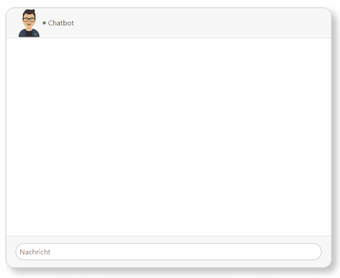

# Question-Answering Fitness Chatbot mit graphischem Webinterface



## Beispielfragen

Beispielfragen sind in `qa.json` zu finden.
Im besten Fall erkennt der Chatbot in änlich gestellten Fragen Muster und liefert die entsprechende Antwort.

## Anleitung zum Starten

```bash
python manage.py runserver
```

## Requirements

```bash
pip install requirements.py
```

## References

[[1]](http://citeseerx.ist.psu.edu/viewdoc/download?doi=10.1.1.676.4320&rep=rep1&type=pdf) Hochreiter, Sepp, and Jürgen Schmidhuber. "Long short-term memory." Neural computation 9.8 (1997): 1735-1780.

[[2]](https://getavataaars.com/) Avatar-Creator
